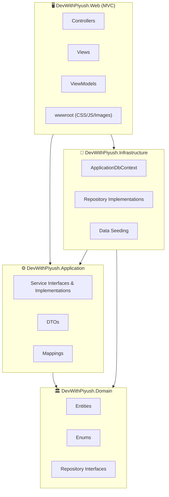
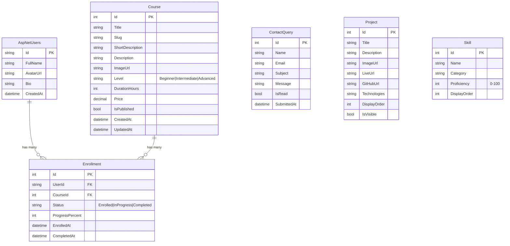

# DevWithPiyush — Training + Portfolio Platform (MVP)

Build a production-ready ASP.NET Core MVC platform with clean architecture, role-based authentication, course management, and a stunning black & white animated UI.

**Runtime:** .NET 10 | **ORM:** EF Core | **DB:** SQL Server (LocalDB for dev) | **UI:** Bootstrap 5 + Custom CSS

---

## User Review Required

> [!IMPORTANT]
> **SQL Server Connection:** The plan uses `(localdb)\MSSQLLocalDB` for development. If you have a different SQL Server instance, please provide the connection string.

> [!IMPORTANT]
> **Admin Credentials:** Seed data will create an admin account `admin@devwithpiyush.com` / `Admin@123456`. Change this immediately in production.

> [!WARNING]
> **No Payment Integration in Phase 1:** Enrollment is simulated (instant success). The architecture is designed so Razorpay can be plugged in later via an `IPaymentService` interface.

---

## Open Questions

1. **Domain/Branding:** Should the hero tagline be "Full-Stack Developer | Trainer | Mentor" or something else?
2. **Certificate:** Should the dummy PDF certificate include your actual name/logo, or generic placeholder text?
3. **Contact Form:** Should contact form submissions also send an email notification, or just store in DB for now?

---

## Architecture Overview



> **Why this structure?** Domain has zero dependencies. Application defines service contracts. Infrastructure implements data access. Web is the thin composition root. This keeps business logic testable and framework-independent.

---

## Proposed Changes

### Solution & Folder Structure

```
DevWithPiyush/
├── DevWithPiyush.sln
│
├── src/
│   ├── DevWithPiyush.Domain/           # Entities, Enums, Interfaces
│   │   ├── Entities/
│   │   │   ├── Course.cs
│   │   │   ├── Enrollment.cs
│   │   │   ├── ContactQuery.cs
│   │   │   ├── Project.cs
│   │   │   ├── Skill.cs
│   │   │   └── ApplicationUser.cs
│   │   ├── Enums/
│   │   │   ├── EnrollmentStatus.cs
│   │   │   └── CourseLevel.cs
│   │   └── Interfaces/
│   │       ├── IRepository.cs
│   │       └── IUnitOfWork.cs
│   │
│   ├── DevWithPiyush.Application/      # Services, DTOs, Mappings
│   │   ├── DTOs/
│   │   │   ├── CourseDto.cs
│   │   │   ├── EnrollmentDto.cs
│   │   │   ├── ContactQueryDto.cs
│   │   │   ├── DashboardDto.cs
│   │   │   └── StudentDto.cs
│   │   ├── Interfaces/
│   │   │   ├── ICourseService.cs
│   │   │   ├── IEnrollmentService.cs
│   │   │   ├── IContactService.cs
│   │   │   └── IDashboardService.cs
│   │   └── Services/
│   │       ├── CourseService.cs
│   │       ├── EnrollmentService.cs
│   │       ├── ContactService.cs
│   │       └── DashboardService.cs
│   │
│   ├── DevWithPiyush.Infrastructure/   # EF Core, Repositories, Seeding
│   │   ├── Data/
│   │   │   ├── ApplicationDbContext.cs
│   │   │   └── SeedData.cs
│   │   ├── Repositories/
│   │   │   ├── Repository.cs
│   │   │   └── UnitOfWork.cs
│   │   └── Migrations/
│   │
│   └── DevWithPiyush.Web/             # MVC Controllers, Views, wwwroot
│       ├── Controllers/
│       │   ├── HomeController.cs
│       │   ├── AccountController.cs
│       │   ├── CourseController.cs
│       │   ├── StudentController.cs
│       │   └── AdminController.cs
│       ├── ViewModels/
│       │   ├── HomeViewModel.cs
│       │   ├── LoginViewModel.cs
│       │   ├── RegisterViewModel.cs
│       │   ├── CourseViewModel.cs
│       │   ├── StudentDashboardViewModel.cs
│       │   └── AdminDashboardViewModel.cs
│       ├── Views/
│       │   ├── Shared/
│       │   │   ├── _Layout.cshtml
│       │   │   ├── _LoginPartial.cshtml
│       │   │   ├── _Notification.cshtml
│       │   │   └── _ValidationScriptsPartial.cshtml
│       │   ├── Home/
│       │   │   ├── Index.cshtml          (Landing page)
│       │   │   ├── About.cshtml
│       │   │   └── Contact.cshtml
│       │   ├── Account/
│       │   │   ├── Login.cshtml
│       │   │   └── Register.cshtml
│       │   ├── Course/
│       │   │   ├── Index.cshtml          (Listing)
│       │   │   └── Details.cshtml
│       │   ├── Student/
│       │   │   ├── Dashboard.cshtml
│       │   │   └── Certificate.cshtml
│       │   └── Admin/
│       │       ├── Index.cshtml          (Dashboard)
│       │       ├── Courses.cshtml
│       │       ├── CourseForm.cshtml
│       │       ├── Students.cshtml
│       │       ├── Enrollments.cshtml
│       │       └── Queries.cshtml
│       ├── wwwroot/
│       │   ├── css/
│       │   │   ├── site.css              (Design system + animations)
│       │   │   └── admin.css
│       │   ├── js/
│       │   │   ├── site.js               (Scroll animations, interactions)
│       │   │   └── admin.js
│       │   └── images/
│       ├── Program.cs
│       └── appsettings.json
```

---

### Database Schema



---

### Component Details

---

#### Domain Layer

##### [NEW] DevWithPiyush.Domain/Entities/ApplicationUser.cs
Extends `IdentityUser` with `FullName`, `AvatarUrl`, `Bio`, `CreatedAt`. This is the single identity entity.

##### [NEW] DevWithPiyush.Domain/Entities/Course.cs
Core entity with `Title`, `Slug` (URL-friendly), `ShortDescription`, `Description`, `ImageUrl`, `Level` (enum), `DurationHours`, `Price`, `IsPublished`, timestamps. Navigation to `Enrollments`.

##### [NEW] DevWithPiyush.Domain/Entities/Enrollment.cs
Join entity: `UserId` → `ApplicationUser`, `CourseId` → `Course`, `Status` (enum), `ProgressPercent`, `EnrolledAt`, `CompletedAt`.

##### [NEW] DevWithPiyush.Domain/Entities/ContactQuery.cs
Stores contact form submissions: `Name`, `Email`, `Subject`, `Message`, `IsRead`, `SubmittedAt`.

##### [NEW] DevWithPiyush.Domain/Entities/Project.cs & Skill.cs
Portfolio data: projects with tech stack tags, skills with proficiency percentages.

##### [NEW] DevWithPiyush.Domain/Interfaces/IRepository.cs
Generic repository interface: `GetByIdAsync`, `GetAllAsync`, `FindAsync(predicate)`, `AddAsync`, `Update`, `Delete`. Keeps Domain independent of EF Core.

##### [NEW] DevWithPiyush.Domain/Interfaces/IUnitOfWork.cs
Wraps `SaveChangesAsync()` + exposes typed repository properties for each entity.

---

#### Infrastructure Layer

##### [NEW] DevWithPiyush.Infrastructure/Data/ApplicationDbContext.cs
Inherits `IdentityDbContext<ApplicationUser>`. Configures entity relationships via Fluent API. Adds composite unique index on `Enrollment(UserId, CourseId)` to prevent duplicate enrollments.

##### [NEW] DevWithPiyush.Infrastructure/Data/SeedData.cs
Static method called at startup. Seeds:
- Roles: `Admin`, `Student`
- Admin user: `admin@devwithpiyush.com`
- 6 sample courses (C#, ASP.NET Core, React, SQL, Azure, Docker)
- 5 portfolio projects
- 8 skills with proficiency levels

##### [NEW] DevWithPiyush.Infrastructure/Repositories/Repository.cs
Generic EF Core implementation of `IRepository<T>`. Uses `DbSet<T>` internally.

##### [NEW] DevWithPiyush.Infrastructure/Repositories/UnitOfWork.cs
Implements `IUnitOfWork`. Manages repository lifetimes and transaction scope.

---

#### Application Layer

##### [NEW] DevWithPiyush.Application/Services/CourseService.cs
- `GetPublishedCoursesAsync()` → returns only `IsPublished = true`
- `GetCourseBySlugAsync(slug)` → for SEO-friendly URLs
- `CreateCourseAsync(dto)`, `UpdateCourseAsync(dto)`, `DeleteCourseAsync(id)`
- Auto-generates slug from title

##### [NEW] DevWithPiyush.Application/Services/EnrollmentService.cs
- `EnrollStudentAsync(userId, courseId)` → checks for duplicate, creates enrollment
- `GetStudentEnrollmentsAsync(userId)` → with course details
- `UpdateProgressAsync(enrollmentId, percent)` → marks completed at 100%
- `GenerateCertificateAsync(enrollmentId)` → returns PDF bytes (dummy for now)

##### [NEW] DevWithPiyush.Application/Services/ContactService.cs
- `SubmitQueryAsync(dto)` → validates and stores
- `GetAllQueriesAsync()` → for admin
- `MarkAsReadAsync(id)`

##### [NEW] DevWithPiyush.Application/Services/DashboardService.cs
- `GetAdminDashboardAsync()` → aggregate counts (total courses, students, enrollments, unread queries)
- `GetStudentDashboardAsync(userId)` → enrolled courses with progress

---

#### Web (Presentation) Layer

##### [NEW] DevWithPiyush.Web/Program.cs
Composition root. Registers all DI services:
```
- AddDbContext with SQL Server
- AddIdentity with roles
- AddScoped for IUnitOfWork, services
- UseAuthentication + UseAuthorization
- Call SeedData.InitializeAsync()
- Configure cookie paths (Login, AccessDenied)
- Add AntiForgery
```

##### [NEW] DevWithPiyush.Web/Controllers/HomeController.cs
- `Index()` → loads skills, projects, courses for landing page
- `Contact()` GET/POST → contact form with validation
- `About()` → about page

##### [NEW] DevWithPiyush.Web/Controllers/AccountController.cs
- `Login()` GET/POST → with return URL support
- `Register()` GET/POST → auto-assigns "Student" role
- `Logout()` POST
- All use `SignInManager` + `UserManager`

##### [NEW] DevWithPiyush.Web/Controllers/CourseController.cs
- `Index()` → course listing with search/filter
- `Details(slug)` → course details + enroll button
- `Enroll(courseId)` POST → `[Authorize]`, simulates payment success

##### [NEW] DevWithPiyush.Web/Controllers/StudentController.cs
- `[Authorize(Roles = "Student")]`
- `Dashboard()` → enrolled courses, progress
- `UpdateProgress(enrollmentId, percent)` POST
- `DownloadCertificate(enrollmentId)` → returns PDF

##### [NEW] DevWithPiyush.Web/Controllers/AdminController.cs
- `[Authorize(Roles = "Admin")]`
- `Index()` → dashboard with stats cards
- `Courses()` → CRUD listing
- `CreateCourse()` / `EditCourse(id)` GET/POST
- `DeleteCourse(id)` POST
- `Students()` → student listing
- `Enrollments()` → all enrollments
- `Queries()` → contact queries with mark-read

---

### UI/UX Design System

#### Color Palette
| Token | Value | Usage |
|-------|-------|-------|
| `--bg-primary` | `#0a0a0a` | Page background |
| `--bg-secondary` | `#111111` | Cards, sections |
| `--bg-elevated` | `#1a1a1a` | Hover states, modals |
| `--text-primary` | `#ffffff` | Headings |
| `--text-secondary` | `#a0a0a0` | Body text |
| `--text-muted` | `#666666` | Captions |
| `--accent` | `#ffffff` | CTAs, borders |
| `--accent-hover` | `#e0e0e0` | Hover states |
| `--border` | `#222222` | Dividers |
| `--shadow` | `0 4px 24px rgba(0,0,0,0.5)` | Card shadows |
| `--success` | `#22c55e` | Progress, success states |
| `--danger` | `#ef4444` | Errors, delete actions |

#### Typography
- **Font:** Inter (Google Fonts) — clean, modern, highly legible
- **Headings:** 700 weight, letter-spacing: -0.02em
- **Body:** 400 weight, line-height: 1.6

#### Animations
| Effect | Implementation |
|--------|---------------|
| Scroll reveal | `IntersectionObserver` + CSS `translateY(30px)` → `translateY(0)` with `opacity` |
| Hero text | Staggered `@keyframes slideUp` with `animation-delay` per line |
| Progress bars | CSS `@keyframes fillBar` width animation on scroll |
| Card hover | `transform: translateY(-4px)` + `box-shadow` increase |
| Button hover | Background invert (white→black, black→white) with `transition: 0.3s` |
| Page transitions | `@keyframes fadeIn` on main content |
| Nav scroll | Background blur + border-bottom on scroll via JS |

#### Responsive Breakpoints
```css
/* Mobile first */
@media (min-width: 576px)  { /* sm */ }
@media (min-width: 768px)  { /* md */ }
@media (min-width: 992px)  { /* lg */ }
@media (min-width: 1200px) { /* xl */ }
```

---

### Security Implementation

| Measure | Implementation |
|---------|---------------|
| Anti-forgery tokens | `@Html.AntiForgeryToken()` on all forms + `[ValidateAntiForgeryToken]` on POST actions |
| Role-based auth | `[Authorize(Roles = "Admin")]` on admin controllers, `[Authorize(Roles = "Student")]` on student controllers |
| Password policy | Min 8 chars, uppercase, lowercase, digit, special char via Identity options |
| Cookie security | `HttpOnly`, `Secure`, `SameSite=Strict`, sliding expiration |
| Input validation | Data annotations on ViewModels + server-side ModelState validation |
| SQL injection | Parameterized queries via EF Core (no raw SQL) |
| XSS prevention | Razor auto-encoding + explicit `@Html.Raw()` only where needed |
| HTTPS redirect | `UseHttpsRedirection()` middleware |

---

## Verification Plan

### Automated Verification
1. **Build check:** `dotnet build` — must compile with zero errors
2. **Database:** `dotnet ef migrations add InitialCreate` + `dotnet ef database update` — schema created
3. **Run:** `dotnet run` — app starts on `https://localhost:5001`

### Browser Verification (using browser tool)
1. **Landing page:** Visit `/` → verify hero animation, sections render, responsive layout
2. **Registration:** Register a new student account → verify redirect to dashboard
3. **Login:** Login as admin → verify admin dashboard loads with stats
4. **Course CRUD:** Create, edit, delete a course from admin panel
5. **Enrollment:** Login as student → browse courses → enroll → verify appears in dashboard
6. **Contact form:** Submit contact form → verify stored in DB → visible in admin queries
7. **Authorization:** Try accessing `/Admin` as student → verify redirect to Access Denied
8. **Responsive:** Resize browser to mobile → verify layout adapts

### Manual Verification
- Certificate download produces a valid PDF
- All animations play smoothly at 60fps
